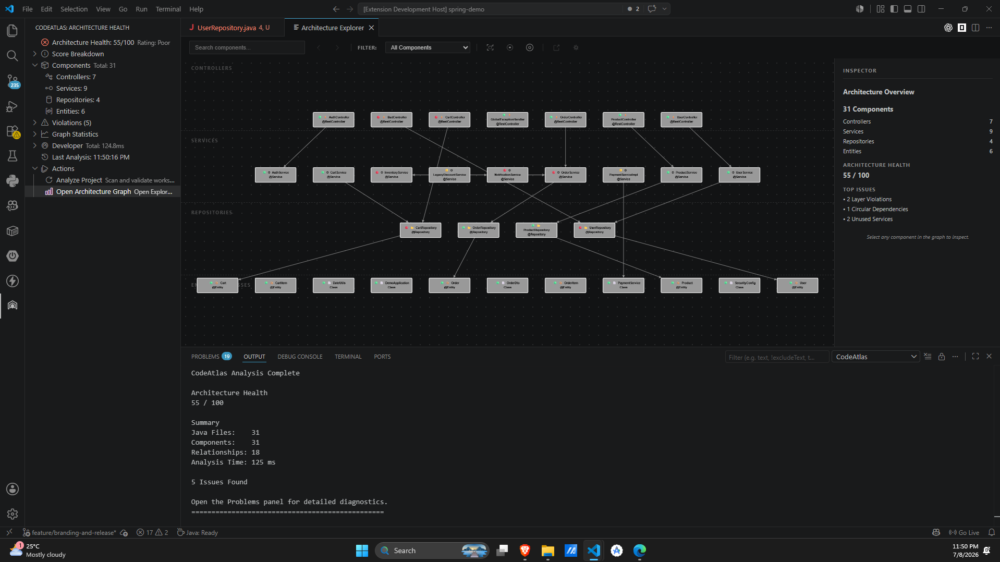
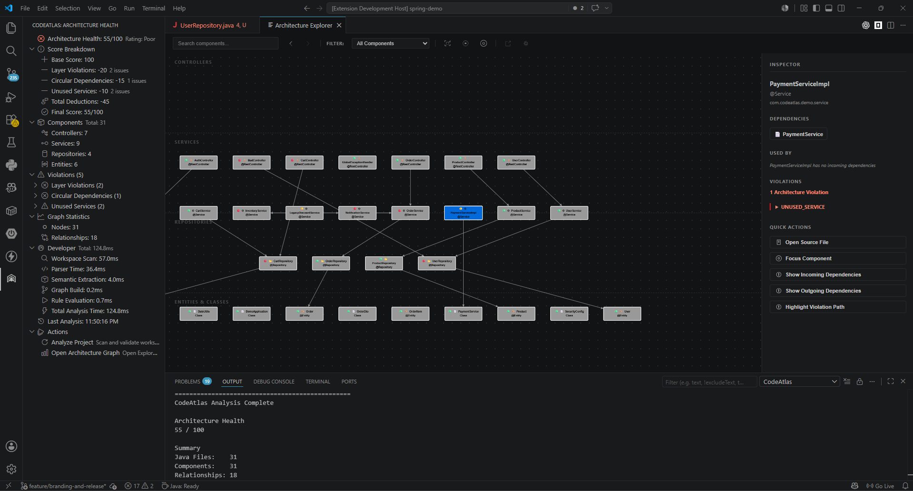
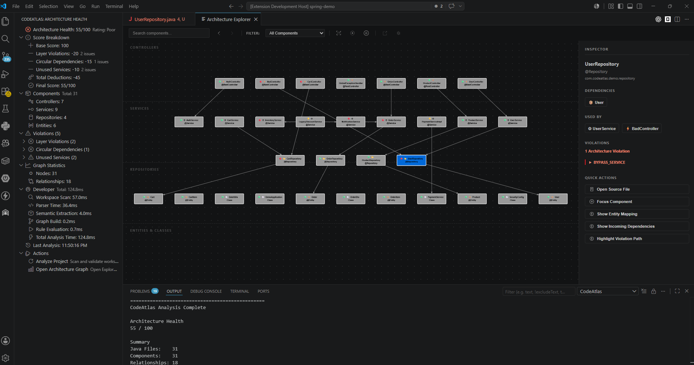

# CodeAtlas

> **The local-first architectural linter and visualization suite for Spring Boot codebases.**

CodeAtlas is an offline, zero-telemetry VS Code extension that parses Java source files on demand to validate and visualize Spring Boot architectural layering, dependency lines, and component relationships. By maintaining a semantic dependency graph of your workspace, CodeAtlas acts as the "ESLint for Java Architecture," providing instant feedback, visual graphs, and editor diagnostics without relying on external compilers, dynamic reflection, or cloud servers.

---

## Why CodeAtlas?

As software systems grow, architectural boundaries inevitably erode. Developers bypass layers (for example, injecting repositories directly into controllers), introduce bidirectional circular dependencies, or leave stale services behind. Traditional tools like ArchUnit require writing and running unit tests, which can slow down CI pipelines. Other tools run on cloud servers, posing privacy concerns.

CodeAtlas runs entirely local inside the VS Code Extension Host. It builds an in-memory directed graph of your codebase's components in seconds, evaluates strict architectural rules, and publishes problems directly into the VS Code Problems panel as inline editor diagnostics.

---

## Key Features

*   **Architecture Health Score**: Evaluates your codebase from 0 to 100 based on structural checks. Deducts score for layer violations (-10), cycles (-15), and unused services (-5).
*   **Layer Constraint Validation**: Automatically flags controller-bypass violations (for example, Controllers directly injecting Repositories).
*   **Cycles Finder**: Detects complex circular dependency loops (for example, `ServiceA -> ServiceB -> ServiceA`) while ignoring expected database-level ORM relationships.
*   **Unused Service Finder**: Pinpoints services with zero incoming dependency connections, identifying candidate dead code.
*   **Interactive Graph Webview**: Renders your codebase's components (Controllers, Services, Repositories, Entities) and relationships dynamically using Cytoscape.js, supporting zoom, pan, and hover highlighting.
*   **Native Sidebar Dashboard**: Displays health scores, component distributions, analysis execution times, and quick-action buttons.
*   **Zero Telemetry**: CodeAtlas operates 100% offline; your source code never leaves your local workspace.

---

## Interface Overview

CodeAtlas currently ships with two primary surfaces inside VS Code plus standard diagnostics integration:

*   **Architecture Health Sidebar**: Summarizes the health score, component counts, and rule findings in a dedicated Activity Bar view.
*   **Architecture Explorer Webview**: Opens an interactive Cytoscape-based graph for exploring controllers, services, repositories, entities, and their relationships.
*   **Problems Panel Diagnostics**: Publishes rule violations directly into the standard VS Code Problems panel and as inline editor diagnostics.

## Screenshots

### Architecture Overview



### Architecture Violation



### Unused Service Detection



---

## Quick Start

1.  **Open** any Spring Boot or Java project in VS Code.
2.  Press `Ctrl + Shift + P` (or `Cmd + Shift + P` on macOS) to open the Command Palette.
3.  Type and run `CodeAtlas: Analyze Project`.
4.  Open the **CodeAtlas Sidebar View** in the Activity Bar to review the health dashboard, or view warnings directly in the **Problems** tab.
5.  Click the **Open Architecture Explorer** button in the sidebar to load the interactive Cytoscape graph visualization.

---

## Supported Java & Spring Boot Constructs

CodeAtlas parses and resolves annotations and relationships for:
*   **Spring Components**: `@RestController`, `@Controller`, `@Service`, `@Repository`, `@Component`, `@Configuration`, `@Bean`.
*   **Dependency Injections**: Constructor injection, `@Autowired` field injection, `@Qualifier`, `@Primary`, and `@Lazy` resolutions.
*   **Recursive Interface Resolution**: Detects indirect repositories that inherit from custom bases (for example, deep custom repository hierarchies).
*   **JPA & ORM Relations**: `@Entity`, `@MappedSuperclass`, `@Embeddable`, `@OneToOne`, `@OneToMany`, `@ManyToOne`, `@ManyToMany`, `@Embedded`, `@EmbeddedId`, `@IdClass`.
*   **Java Language Coverage**: Records, Enums, Interfaces, Abstract/Sealed/Inner classes, and complex Generics.

See [SUPPORTED_FEATURES.md](SUPPORTED_FEATURES.md) for a comprehensive list of supported constructs.

---

## Architecture Pipeline

CodeAtlas performs static analysis using a decoupled 6-stage pipeline:

```text
[VS Code Command]
       |
[WorkspaceScanner]
       | (Discovers local .java files)
   [JavaParser]
       | (Generates AST)
[SemanticExtractor]
       | (Extracts components, dependencies, and imports)
[ComponentTypeResolver]
       | (Resolves deep inheritance hierarchies)
[ArchitectureGraph]
       | (Builds directed graph with classified typed edges)
[ArchitectureEngine]
       | (Evaluates Layer, Circular, and Unused rules)
[DiagnosticPublisher] --> [Problems panel & Sidebar Dashboard]
```

See [docs/architecture/architecture_overview.md](docs/architecture/architecture_overview.md) for deep technical details.

---

## Real-World Conformance Validation

To ensure production-grade reliability, CodeAtlas is validated against major open-source Spring Boot repositories:

| Metric | Spring PetClinic | PiggyMetrics | Shopizer |
| :--- | :--- | :--- | :--- |
| **Java Files Scanned** | 48 | 97 | 1,210 |
| **Parsed Components** | 48 | 97 | 1,210 |
| **Relationships (Edges)** | 96 | 201 | 4,780 |
| **Layer Violations** | 5 | 0 | 0 |
| **Circular Dependencies** | 0 | 0 | 1 |
| **Unused Services** | 0 | 0 | 2 |
| **Architecture Health** | **50/100** | **100/100** | **75/100** |
| **Analysis Duration** | **279 ms** | **163 ms** | **2,692 ms** |

Detailed reports for each project are located under `docs/validation/`.

---

## Installation

### Install as a User

CodeAtlas is not yet published to the VS Code Marketplace. Until publication is complete, install it locally from a packaged `.vsix` file:

1.  Obtain a `codeatlas-*.vsix` build from the project maintainer or package one from this repository.
2.  In VS Code, open the Extensions view.
3.  Select the `...` menu in the top-right corner of the Extensions panel.
4.  Choose `Install from VSIX...` and select the `.vsix` file.

### Build from Source for Contributors

Ensure you have [Node.js](https://nodejs.org/) (v18.x or above) installed.

1.  Clone the repository:
    ```bash
    git clone https://github.com/varunkulkarninagpur/codeAtlas.git
    cd codeAtlas
    ```
2.  Install dependencies and compile:
    ```bash
    npm install
    npm run compile
    ```
3.  Run unit and conformance tests:
    ```bash
    npm test
    ```
4.  Package the extension into a `.vsix` file:
    ```bash
    npx vsce package
    ```
5.  In VS Code, use `Install from VSIX...` from the Extensions view to side-load the packaged extension.

---

## License

This project is licensed under the [MIT License](LICENSE).
