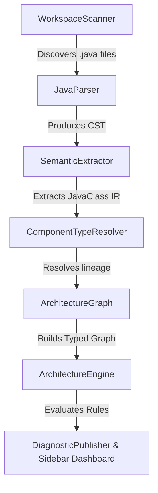

# CodeAtlas Technical Architecture & Design Decisions

This document details the architectural design and technical specifications of CodeAtlas v1.0.0.

---

## 1. Architectural Pipeline Overview

CodeAtlas operates as a decoupled, 6-stage static analysis pipeline:

---

## 2. Component Design & Implementations

### 2.1 Parser Stage (`JavaParser`)
*   **Implementation**: Utilizes `java-parser`, a parser built on top of Chevrotain to output a Concrete Syntax Tree (CST) directly in JavaScript/TypeScript.
*   **Design Decision**: A pure JavaScript static parser was chosen over full Java compilation (e.g., using javac or Eclipse compiler) or JVM runtime inspection. This keeps CodeAtlas **lightweight, platform-independent, and fast**. It does not require a local JDK or build-tool configurations (e.g., Maven/Gradle classpath resolution) to execute, enabling zero-config startup on any codebase.

### 2.2 Semantic Extraction (`SemanticExtractor`)
*   **Implementation**: Walks the AST/CST to map node segments into an intermediate **`JavaClass`** representation.
*   **Design Decision**: Decouples the verbose AST format from the downstream analysis graph. The `JavaClass` structure captures only the relevant metadata:
    *   Declared package name and explicit import statements.
    *   Component class type (Controller, Service, Repository, Entity, Configuration, etc.).
    *   Field-level injected types and constructor parameter types.
    *   Source token coordinate indices (used for precise VS Code line-highlighting).

### 2.3 Inheritance Resolution (`ComponentTypeResolver`)
*   **Implementation**: A recursive resolver that traces class and interface hierarchies within the workspace.
*   **Design Decision**: Large enterprise projects frequently define custom base repository interfaces (e.g., `interface CustomOwnerRepository extends BaseRepository<Owner, Long>`) which in turn extend Spring Data. A simple annotation check would fail to identify `CustomOwnerRepository` as a `REPOSITORY` component. The `ComponentTypeResolver` solves this generically by recursively crawling up the interface inheritance lineage to infer types, eliminating false positives on repository classifications.

### 2.4 Typed Relationship Graph (`ArchitectureGraph`)
*   **Implementation**: A directed graph representing components as vertices and relationships as edges. Vertices and edges are semantically typed using the **`RelationshipType`** enum:
    *   `DEPENDENCY`: Structural class couplings (constructor injections, autowires).
    *   `INHERITANCE`: Class extensions (`extends`) or interface implementations (`implements`).
    *   `ORM_RELATIONSHIP`: JPA entity mapping relationships (`@OneToMany`, `@ManyToOne`, etc.).
*   **Design Decision**: Early versions modeled all relationships as generic directed edges. This caused database entity bidirectional mappings to trigger false circular dependencies. Classifying relationship edges allows the Rule Engine to ignore database-level bidirectional pointers and isolate analysis solely to functional software dependencies.

### 2.5 Validation Engine (`ArchitectureEngine` & `IArchitectureRule`)
*   **Implementation**: Runs rules implementing `IArchitectureRule` over the graph and aggregates `ArchitectureViolation` diagnostics.
    *   `LayerViolationRule`: Ensures no higher layer directly accesses a lower layer by bypassing the intermediate layer (e.g. `Controller ➔ Repository` instead of `Controller ➔ Service ➔ Repository`).
    *   `CircularDependencyRule`: Runs a Depth-First Search (DFS) cycle finder over `DEPENDENCY` and `INHERITANCE` edges, ignoring `ORM_RELATIONSHIP` edges.
    *   `UnusedServiceRule`: Detects `SERVICE` components with 0 incoming `DEPENDENCY` edges.

---

## 3. Health Scoring & Metrics

The **Health Score** acts as an architectural KPI. The score starts at `100/100` and applies discrete, predictable deductions:
*   **Layer Violations**: `-10` per occurrence. Bypassing the service layer represents a critical encapsulation breakdown.
*   **Circular Dependencies**: `-15` per cycle. Bidirectional dependency coupling impedes refactoring, testing, and component isolation.
*   **Unused Services**: `-5` per service. Flags potential dead code.

*Note: The score is capped at a minimum of `0/100` and does not go negative.*

---

## 4. UI Visualizer & Exploration

*   **Implementation**: The visualizer is rendered in a VS Code Webview using **Cytoscape.js**. 
*   **Design Decision**: Cytoscape.js was chosen for its high-performance canvas rendering and native layout support (e.g., DAGRE hierarchical layouts), which easily scales to show 1,200+ components (such as Shopizer) without lag. Color coding maps to component types:
    *   **Red**: Controllers
    *   **Blue**: Services
    *   **Green**: Repositories
    *   **Yellow**: Entities
    *   **Gray**: Plain classes/Configurations
*   **Diagnostics Publication**: Violations are converted to VS Code `Diagnostic` objects and published to the `vscode.languages.createDiagnosticCollection`, immediately placing warning squiggles under the exact code token that created the violation.
