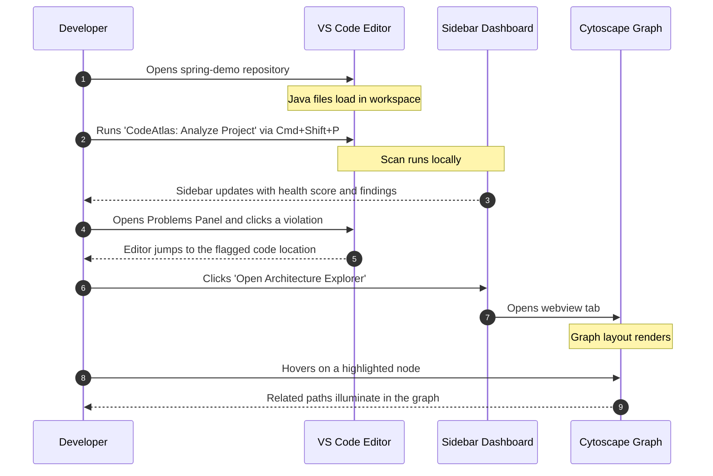

# CodeAtlas Branding, Screenshots & Demo Launch Plan

This document details the visual design specifications, screenshot plan, and demonstration storyboard for the CodeAtlas v1.0.0 release.

---

## 1. Branding Assets Specifications

To establish a premium, professional presence on the VS Code Marketplace and GitHub, the following assets should be generated:

### 1.1 Repository Logo & Extension Icon
*   **Extension Icon**:
    *   *Size*: `128 x 128` pixels (required by VS Code Marketplace).
    *   *Format*: Transparent `PNG` (packaged with extension) and `SVG` source.
    *   *Design*: A stylized, circular atlas globe (wireframe network style) intersecting with node markers, utilizing a vibrant blue-to-cyan HSL gradient on a dark charcoal background.
*   **Repository Logo**:
    *   *Size*: Standard horizontal header representation.
    *   *Format*: `SVG` for crisp rendering.
    *   *Design*: The icon logo followed by the word **CodeAtlas** in clean **Outfit** or **Inter** typography.

### 1.2 Marketplace & GitHub Visuals
*   **VS Code Marketplace Banner**:
    *   *Size*: `800 x 400` pixels.
    *   *Format*: `PNG`.
    *   *Design*: Sleek, dark mode dashboard background. Showcases the extension name, tagline, a miniature interactive node graph, and a badge reading `v1.0.0 Stable`.
*   **GitHub Social Preview Image**:
    *   *Size*: `1280 x 640` pixels (2:1 aspect ratio).
    *   *Format*: High-quality `PNG`.
    *   *Design*: Features the CodeAtlas typography in the center, flanked by visual representations of layer violations, cycle indicators, and a subset of the Cytoscape graph rendering.

---

## 2. Launch Screenshots Plan

The following screenshots are recommended for the VS Code Marketplace page and the README:

1.  **Architecture Health Sidebar**:
    *   *Target*: CodeAtlas activity bar tab.
    *   *Source Project*: `examples/enterprise-demo`.
    *   *Focus*: Display the health score, component counters, and violation summaries clearly.
2.  **Interactive Cytoscape Visualizer**:
    *   *Target*: Visual graph explorer tab.
    *   *Source Project*: `examples/spring-demo` or `examples/enterprise-demo`.
    *   *Focus*: Display color-coded components arranged in a hierarchical layout with controllers on top, services in the middle, and repositories/entities at the bottom.
3.  **Inline Editor Diagnostics**:
    *   *Target*: VS Code editor split view.
    *   *Source Project*: `examples/spring-demo`.
    *   *Focus*: Show a representative diagnostic squiggle and hover message on a class that intentionally violates a rule.
4.  **Problems Panel Aggregation**:
    *   *Target*: VS Code bottom panel.
    *   *Source Project*: `examples/enterprise-demo`.
    *   *Focus*: Display detected layer, cycle, and unused-component violations grouped by file and line number.

---

## 3. Demo Storyboard (60-90 Seconds GIF)

This storyboard outlines a candidate sequence for the launch walk-through GIF displayed in the README or Marketplace listing:

### Video Recording Spec
*   **Resolution**: 1280x720 (720p) or 1920x1080 (1080p).
*   **Theme**: Default Dark Modern (VS Code) with clean font styling such as JetBrains Mono.
*   **Output**: Export as a high-fidelity compressed `.gif`, ideally under `8 MB` for fast README loading.
